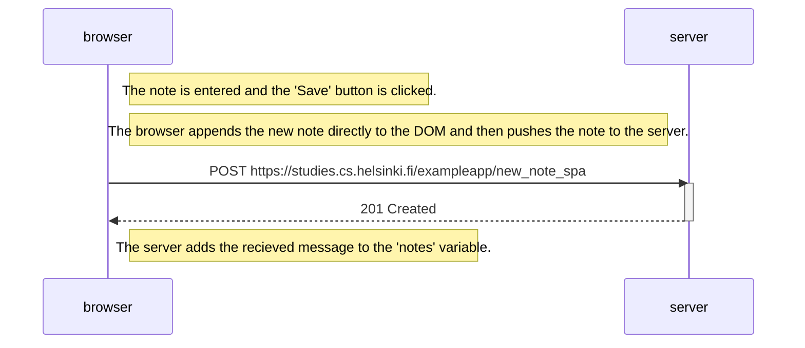

```mermaid
sequenceDiagram
    participant browser
    participant server

    Note right of browser: The note is entered and the 'Save' button is clicked.
    Note right of browser: The browser appends the new note directly to the DOM and then pushes the note to the server.

    browser->>server: POST https://studies.cs.helsinki.fi/exampleapp/new_note_spa
    activate server
    server-->>browser: 201 Created
    deactivate server

    Note right of browser: The server adds the recieved message to the 'notes' variable.
```
